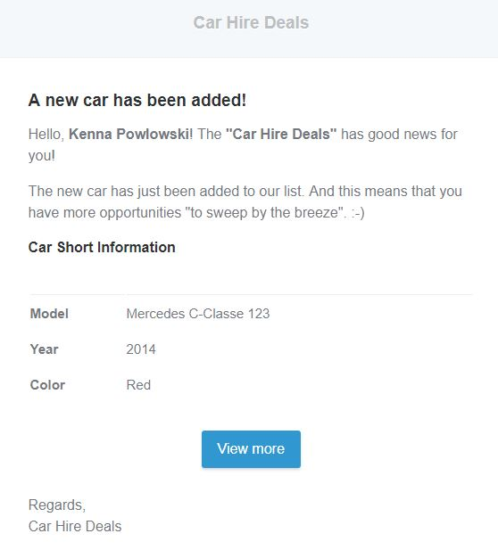

## Домашнее задание: разработка системы рассылки email сообщений с помощью очереди (queue)

### Требования
Реализовать очередь для простой рассылки уведомлений пользователям о добавлении новой машины в БД используя фреймворк Laravel.

***

### Описание работы

Код создания экземпляра ```SendNotificationEmail``` и отправки его на выполнение (```dispatch()```) собран в трейте ```DispatchCarStoredNotification```, который может быть гибко использован в любом необходимом месте (в нашем случае - это метод ```store()``` у контроллеров ```CarController``` и ```Api\Admin\AdminCarController```).  

На вход принимается экземпляр созданной машины ```App\Entity\Car```.  На вход также принимается ```App\Entity\User```, однако это было сделано специально для успешного выполнения теста. Для реального применения экземпляр пользователя ***не нужен***, поскольку ```SendNotificationEmail``` использует ```App\Managers\Eloquent\UserManager``` для выборки всех пользователей.  

#### Алгоритм выполнения действий

1. В случае успешного сохранения новой машины в методе контроллера ```store()``` ее экземпляр передается в метод ```DispatchCarStoredNotification```.

2. В методе ```carStoredNotification()``` создается экземпляр _Job_ ```SendNotificationEmail```, который принимает нашу ```App\Entity\Car``` и ставится на очередь выполнения **notification** (название определено для драйвера _beanstalkd_ в ```config/queue.php```).

3. Выполнение описано в методе ```handle()``` нашей  ```SendNotificationEmail```. Менеджер пользователей получает весь список, и далее в цикле каждому из них отправляется сообщение с помощью фасада ```Mail```. Метод ```to()``` принимает _e-mail_ пользователя, а метод ```send()``` - экземпляр ```CarStored```, отвечающий за построение письма.

4. ```CarStored``` принимает сущности ```App\Entity\User``` и ```App\Entity\Car``` для получения от них необходимых данных (в нашем случае, полное имя пользователя и данные о машине: модель, номер, цвет и т.д.). Само построение письма происходит в методе ```build()```.

5. Для форматирования содержимого письма используется разметка **Markdown**, за которую отвечает ```markdown()```, принимающий в качестве параметра путь к шаблону письма - _'emails.cars.stored'_.

6. Для запуска очереди на выполнение ввести ```php artisan queue:work --queue=notification```. Также можно использовать в конце флаг ```--once``` для одноразового запуска очереди.  

   Для тестирования просмотра сообщений был использован сервис [**mailtrap.io**](https://mailtrap.io/).

***

#### Пример отправленного письма


